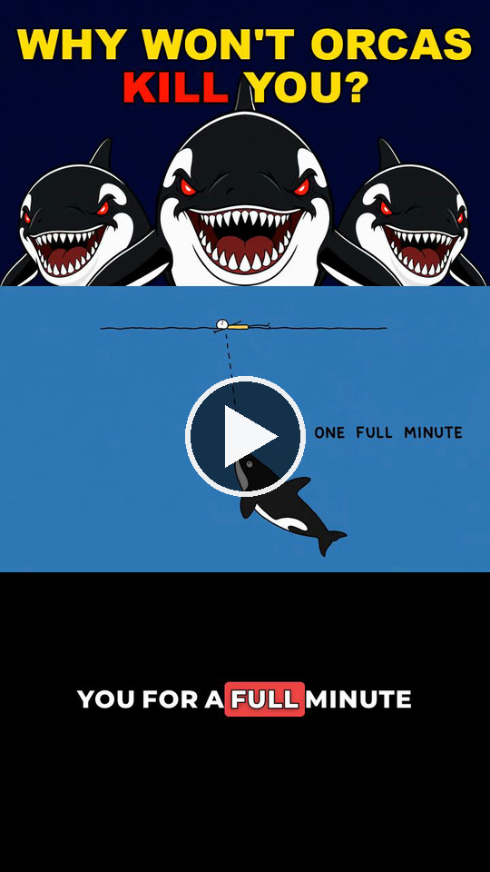

# Doodle Explainer Video

A Claude Code skill that produces faceless 9:16 doodle-explainer videos in the
viral three-band format: a static clickbait banner on top, crude stick-figure
illustrations in the middle, an empty black band on the bottom, over a single
fast narration track with no music.

Media generation runs through the **Unsora MCP**. Assembly is local ffmpeg via
`scripts/build_video.py`, which encodes the measured format spec.

## The reference format

[](https://rzowkcqjeadgkwmixtds.supabase.co/storage/v1/object/public/dev/exports/1785243683790-gwn61g.mp4)

**[▶ Watch the reference video](https://rzowkcqjeadgkwmixtds.supabase.co/storage/v1/object/public/dev/exports/1785243683790-gwn61g.mp4)** — 4:37, 720x1280

This is the video every measurement in `references/` was reverse-engineered
from. Note that it burns karaoke captions into the bottom band; this skill
deliberately leaves that band empty, so its output differs there by design.

## What the format is

The frame is split into three fixed horizontal bands that never move. This is
the single most recognisable trait of the format.

| Band | Y range | Height | Content |
|---|---|---|---|
| A — banner | 0–420 | 420 | Static clickbait title + character art, reused for the whole video |
| B — illustration | 420–840 | 420 | The doodle, one per beat, hard cuts only |
| C — empty | 840–1280 | 440 | Pure black, **no text** |

Band C stays empty. It is still load-bearing — it pushes the illustration into
the upper-middle of the frame, clear of the play controls and action buttons
platforms overlay along the bottom of a vertical video.

Output is 720x1280, 30fps, H.264 + AAC.

**No captions, no music, no sound effects, no transitions.** The reference has
none of them, and that restraint is part of the format. Illustration cuts are
the only motion in the frame.

## Requirements

- **Unsora MCP** connected, with credits (`get_credits`)
- `ffmpeg` and `ffprobe` on PATH
- Python 3 with Pillow

## Two production modes

### 1. Three-band vertical

The original 720×1280 static doodle format documented below.

### 2. Animated history for YouTube

A separate 16:9 mode for original hand-drawn history explainers: maps, layered
characters, arrows, labels, camera motion, slide/pop/reveal animation, and
resumable project checkpoints.

```bash
bash scripts/setup.sh
source .venv/bin/activate
python scripts/project.py init "The History of the Silk Road" \
  --template entire-history --duration 12
python scripts/build_animated_video.py scripts/animated_manifest_example.json --draft
```

Read:

- [`references/unknown-frequencies-style.md`](references/unknown-frequencies-style.md) — analysis of 16 reference videos and four original production templates.
- [`references/resumable-workflow.md`](references/resumable-workflow.md) — handoffs between Arena chats.
- [`scripts/animated_manifest_example.json`](scripts/animated_manifest_example.json) — layered animation schema by example.

The animated renderer supports image, text, rectangle, ellipse, and arrow
layers; timed entrances/exits; slide, pop, fade, bob, shake, wipe reveal;
per-layer position/scale animation; camera pans and slow zooms; optional
narration muxing; and final audio normalization. It does not clone another
channel's drawings, voice, scripts, thumbnails, or branding.

## Quick start — vertical mode

Invoke the skill and name a topic:

```
/doodle-explainer-video Why people like their own fart
```

You can constrain the run in the same breath — image model, image count, target
length:

```
/doodle-explainer-video Why people like their own fart. Use gpt-image-2. Keep it within 20 images.
```

## Pick the target length first

| Length | Words | Sections | Illustrations |
|---|---|---|---|
| 60 s | ~215 | 3–4 | ~15 |
| 3 min | ~650 | 8–10 | ~45 |
| 10 min | ~2,200 | 18–25 | ~150 |

Narration runs ~217 wpm and one illustration covers 12–15 words. Three minutes
is the default — the cheapest length that still fits the whole nine-move arc.

## Workflow

1. **Find the paradox.** The topic needs a verifiable surprising fact, a wrong
   obvious explanation, and a real mechanism that generalises to the viewer's
   own life. If any of the three is missing, the last 15% collapses.
2. **Write the script** on the nine-move arc, with real named sources. Get
   sign-off before generating any media — it is the cheapest thing to change.
3. **Break it into beats** of 12–15 words. One beat is one illustration.
4. **Generate the banner** — one 16:9 image, artwork only. The title text is
   composed in afterwards with PIL, never asked of the image model.
5. **Generate the illustrations** — one per beat, 16:9, doodle template.
6. **Generate the voiceover** — one call per section, not per beat.
7. **Assemble** with `build_video.py`.
8. **Check the result** — extract frames and actually look at them.

## Unsora MCP calls used

| Step | Tool |
|---|---|
| Budget check | `get_credits` |
| Banner + illustrations | `create_image` → `wait_for_image` |
| Voice selection | `list_voiceover_voices` |
| Narration | `create_voiceover` → `wait_for_voiceover` |
| Publishing (optional) | `get_accounts`, `create_post` |

Notes that matter in practice:

- `create_image` takes `model` (`gpt-image-2`, `gpt-image-1.5`,
  `nano-banana-2`, `nano-banana-pro`, `seedream-v5-lite`) and `aspectRatio`.
  Generate at `16:9` and let the build script centre-crop to the band.
- `referenceImages` accepts the **https URL** returned by a previous
  `create_image`. Pass the first accepted illustration on every later call or
  the style drifts visibly across the runtime.
- `create_voiceover` bills per **started** 1,000 characters, so per-beat calls
  waste most of every charge. One call per section. Use `stability: 0.5` and
  `<#0.5#>` between sentences where you want a beat of silence.

## Assembly

Write a manifest (see [`scripts/manifest_example.json`](scripts/manifest_example.json)):

```json
{
  "output": "final.mp4",
  "banner": "assets/banner.png",
  "sections": [
    {
      "audio": "audio/01.mp3",
      "beats": [
        {"image": "assets/001.png", "text": "Imagine you are floating in the open ocean."},
        {"image": "assets/002.png", "text": "Something massive moves below."}
      ]
    }
  ]
}
```

Then:

```bash
python3 scripts/build_video.py manifest.json --tempo 1.4
```

Beat timings are derived from each section's measured audio duration, weighted
by character count, so cuts land with the narration. Image and audio paths may
be local files or https URLs — the script downloads them.

### Flags

| Flag | Default | Effect |
|---|---|---|
| `--tempo` | `1.0` | Speed up narration. `1.4` corrects for slow TTS — see below |
| `--gap` | `0.35` | Breath appended after each section |
| `--workdir` | `build` | Scratch directory for composed frames |
| `--keep` | off | Keep composed frames for inspection |
| `--no-normalize` | off | Skip the -16 LUFS normalisation |
| `--music FILE` | off | Optional bed. **Leave off** — the reference has none |
| `--music-db` | `-26.0` | Bed level under the voice |
| `--captions` | off | Burn in karaoke subtitles. **Leave off** |

### Two measured TTS quirks

- **TTS runs slow.** ElevenLabs delivers ~155 wpm against the format's ~217, so
  a script written to the word budget lands ~40% longer than planned. `--tempo
  1.4` hits the target duration *and* the reference's brisk pacing. Measure the
  audio before promising a duration — do not assume the word count.
- **TTS is quiet.** Raw output sits ~5 dB under the reference. The script
  normalises to -16 LUFS by default.

## Layout

```
doodle-explainer-video/
├── SKILL.md                     # the skill instructions Claude follows
├── README.md
├── references/
│   ├── format-spec.md           # measured geometry, colours, cadence, audio
│   ├── script-formula.md        # the nine-move arc and sentence craft
│   └── art-direction.md         # banner + doodle templates, visual grammar
└── scripts/
    ├── build_video.py           # ffmpeg assembly
    └── manifest_example.json
```

Read `format-spec.md` before changing geometry, `script-formula.md` before
writing narration, and `art-direction.md` before generating images. The
format's distinctiveness lives in those details.

## Gotchas

- **Lettering fails sometimes.** Roughly one image in fifteen comes back with
  smudged or illegible hand-lettered labels. Review every illustration before
  assembly and regenerate the failures — with no captions, an unreadable label
  means that beat conveys nothing on screen.
- **Style drift.** Without `referenceImages`, line weight and character design
  wander noticeably over a 10-minute runtime.
- **Budget first.** A 10-minute video is roughly 150 images plus ~20 voiceover
  calls. Check `get_credits` before generating, not after.
- **Fewer images means longer holds.** Capping image count raises the mean hold
  above the reference's 3.4–4.1 s. It still works, but the cutting is slacker.
- **Publishing is outward-facing.** Confirm before `create_post`.
